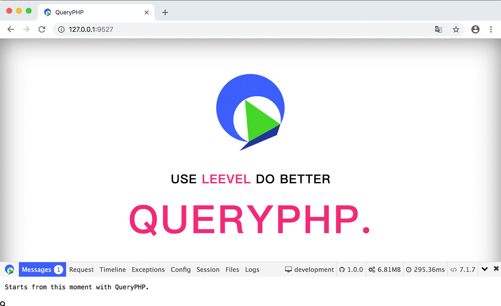

<p align="center">
  <a href="https://github.styleci.io/repos/78216574"></a>
  <a href="https://travis-ci.org/hunzhiwange/queryphp">
    </a>
  <a href='https://coveralls.io/github/hunzhiwange/queryphp?branch=master'></a>
  <a href="https://github.com/hunzhiwange/queryphp/releases">
    </a>
  <a href="http://opensource.org/licenses/MIT">
    </a>
</p>

# The QueryPHP Application

QueryPHP is a modern, high performance PHP 7 resident framework, with engineer user experience as its historical mission, let every PHP application have a good framework.

A hundred percent coverage of the unit tests to facing the bug,based on Zephir implemented framework resident,with Swoole ecology to achieve business resident,
now or in the future step by step. Our vision is **<span style="color:#e82e7d;">USE LEEVEL WITH SWOOLE DO BETTER</span>**, let your business to support more user services.

*The PHP Framework For Code Poem As Free As Wind, Starts From This Moment With QueryPHP.*

* Site: <https://www.queryphp.com/>
* API: <http://api.queryphp.com>
* Document: <https://www.leevel.vip/>

## The core packages

 * QueryPHP On Github: <https://github.com/hunzhiwange/queryphp/>
 * QueryPHP On Gitee: <https://gitee.com/dyhb/queryphp/>
 * Framework On Github: <https://github.com/hunzhiwange/framework/>
 * Framework On Gitee: <https://gitee.com/dyhb/framework/>
 * Leevel On Github: <https://github.com/hunzhiwange/leevel/>
 * Leevel On Gitee: <https://gitee.com/dyhb/leevel>
 * Tests: <https://github.com/leevels/tests/>
 * Packages: <https://github.com/leevels/>

## How to install

## Base use

```
composer create-project hunzhiwange/queryphp myapp dev-master
```

## Visite it



```
php leevel server <Visite http://127.0.0.1:9527/>
```

 * Home <http://127.0.0.1:9527/>
 * Mvc router <http://127.0.0.1:9527/api/test>
 * Mvc restful router http://127.0.0.1:9527/restful/123
 * Mvc restful router with method http://127.0.0.1:9527/restful/123/show
 * Annotation router http://127.0.0.1:9527/api/v1/petLeevelForApi/helloworld
 * Annotation router with bind http://127.0.0.1:9527/api/v2/withBind/foobar
 * php leevel link:public <http://127.0.0.1:9527/public/css/page.css>
 * php leevel link:storage <http://127.0.0.1:9527/storage/logo.png>
 * php leevel link:apis <http://127.0.0.1:9527/apis/>
 * php leevel link:debugbar <http://127.0.0.1:9527/debugbar/debugbar.css>

## Base optimization

### Debug

Modify .env or runtime/bootstrap/option.php.

```
// Environment production、testing and development
ENVIRONMENT = production

// Debug
DEBUG = false
```

### Commands

The commands below can make queryphp faster.

```
php leevel router:cache
php leevel option:cache
php leevel i18n:cache
php leevel view:cache
php leevel autoload (contains `composer dump-autoload --optimize`)
```

Or

```
php leevel production
```

## USE LEEVEL DO BETTER

### Windows

Need to tests.

### Linux

You can download the source code.

```
git clone git@github.com:hunzhiwange/leevel.git
cd ext
```


Then compile it.

```
$/path/to/phpize
$./configure --with-php-config=/path/to/php-config
$make && make install
```

Then add extension to your php.ini,you can see if installation is successful by command php -m.

```
extension = leevel.so
```

## Use Swoole With Ultra High Performance

This will coming back later.

```
php leevel swoole:http
```

## Unified Code Style

```
$cd /data/codes/queryphp
$php-cs-fixer fix --config=.php_cs.dist
```

## License

The QueryPHP framework is open-sourced software licensed under the [MIT license](http://opensource.org/licenses/MIT).
